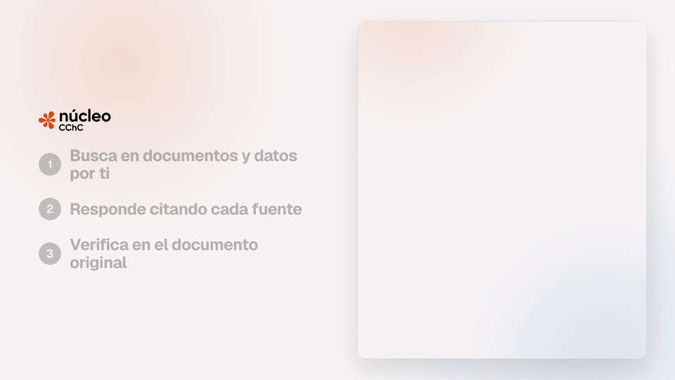
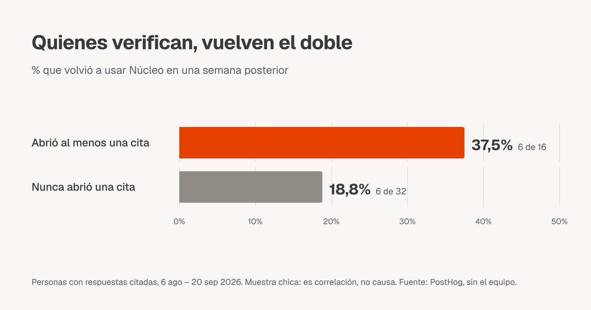

# Cómo logramos _factcheckear_ a nuestros agentes

## Qué es Núcleo

Núcleo es el agente de inteligencia artificial de la Cámara Chilena de la Construcción (CChC). Está hecho para sus socios y colaboradores: le preguntas en lenguaje natural, en la web o por WhatsApp, y busca la respuesta en los documentos, estudios y datos del gremio. Informes de coyuntura, reglamentos, beneficios y cifras de la industria, en un solo lugar.

Núcleo responde citando sus fuentes: marca la frase exacta que sale de cada documento y, con un clic, te lleva a la página donde está escrita, con el mismo pasaje resaltado.

## We think this is the bare minimum

Una respuesta de IA vale lo que vale su fuente. Con el pasaje resaltado en ambos lados, revisar una cifra toma segundos. Esto resulta en confianza y seguridad para nuestros usuarios. Cada afirmación es fácil y rápidamente factcheckeable.

En bipbop creemos que la visibilidad y transparencia de lo que "está pasando detrás" es clave para ofrecer una UX satisfactoria. El hecho de que toda esta trazabilidad esté a un click de distancia nos acerca hacia una retención y engagement saludable con las plataformas que desarrollamos.



Este post es sobre cómo está hecho: la parte que Bedrock nos regala y la parte que tuvimos que resolver nosotros, que es casi toda UX.

## Bedrock te da la cita casi gratis

Los documentos de la Cámara viven en SharePoint (y algunos en Notion). Un job los sincroniza a S3 y de ahí a una Knowledge Base de Amazon Bedrock, que los parsea con Bedrock Data Automation (BDA), los corta en chunks y los indexa.

Cuando el agente busca, llamamos a `Retrieve` (no a `RetrieveAndGenerate`: queremos que el agente decida entre buscar en documentos o consultar la base de datos, y controlar nosotros el formato de la cita). Cada resultado ya trae casi todo lo que una cita necesita:

- `content.text`: el pasaje exacto que se usó.
- `location.s3Location.uri`: de qué archivo salió.
- `metadata["x-amz-bedrock-kb-document-page-number"]`: la página, cuando el documento pasó por BDA.
- Para páginas escaneadas, un chunk `IMAGE` con la página como imagen y su transcripción en markdown. Se la adjuntamos al modelo para que lea cifras de gráficos y tablas.

Con eso armamos cada cita en el tool de búsqueda:

```ts
const rawPage = meta["x-amz-bedrock-kb-document-page-number"];
const page = typeof rawPage === "number" ? rawPage + 1 : null; // BDA cuenta desde 0

citations.push({
  n: refFor(source), // un número por documento, no por chunk
  title: titleFromSource(source),
  source,
  text, // el pasaje: después lo buscamos dentro del PDF
  page,
});
```

Ese `+ 1` es el primer detalle que aprendimos en el camino. Bedrock numera las páginas desde 0: la portada de un PDF es la página 0. Los visores de PDF, y cualquier persona, cuentan desde 1. Sin sumar 1, cada cita abría el documento una página antes de la correcta, justo donde el pasaje no estaba.

El segundo detalle son los duplicados. Un mismo informe suele estar subido en varias carpetas de SharePoint, por ejemplo la del área que lo publica y una carpeta compartida. La Knowledge Base indexa cada copia por separado, así que una búsqueda puede devolver el mismo pasaje dos o tres veces. Como usamos solo los 8 mejores resultados de cada búsqueda, las copias ocupaban cupos que deberían ser de otros documentos, y a veces dejaban fuera la edición más reciente del informe.

Para descartarlas necesitábamos una llave que identificara "el mismo pasaje". El texto no sirve, porque BDA procesa cada copia por separado y no siempre la escribe igual. Pero el contenido de las copias es el mismo, entonces su embedding también lo es, y Bedrock les asigna exactamente el mismo score. Usamos `score + página` como llave: si ya vimos ese par, el resultado es una copia y lo saltamos.

Con esto, el backend ya está resuelto: de cada respuesta sabemos de qué archivo y de qué página salió cada dato. Pero eso solo no le sirve a quien lee. Una lista de archivos al final de la respuesta no dice qué frase sale de cuál, y nadie va a abrir un PDF de 48 páginas para buscar una cifra. Ahí empieza el trabajo de UX.

## Lo difícil es la UX

### Un número por fuente

El prompt le pide al modelo citar con `[n]` justo después de la afirmación, donde `n` es el número de la fuente. Numeramos por documento en vez de por chunk, porque si tres pasajes salen del mismo informe, mostrar `[1]`, `[2]` y `[3]` haría pensar que hay tres fuentes distintas. Con la numeración por documento, los tres son `[1]`: para quien lee, "fuente 1" es un documento, no un trozo de texto.

### Del `[n]` a la frase resaltada

Un `[3]` al final de un párrafo no dice qué parte del párrafo respalda. Así que no mostramos el marcador: resaltamos la afirmación. Un plugin de remark recorre el markdown de la respuesta y, cuando encuentra un `[n]`, envuelve todo lo que hay desde el final de la frase anterior hasta el marcador. Si vienen seguidos (`[1][2]`), la misma frase queda con dos fuentes.

La parte delicada es saber dónde termina la frase anterior. Uno pensaría que basta con buscar el último punto, signo de exclamación o de pregunta:

```ts
const SENTENCE_END = /[.!?]/g;
```

Hasta que el agente responde con una cifra chilena, donde el punto separa los miles:

```
En 2025 se vendieron 18.538 viviendas [1].

/[.!?]/        →  resalta "538 viviendas"
SENTENCE_END   →  resalta "En 2025 se vendieron 18.538 viviendas"
```

La primera regex ve el punto de "18.538" como fin de frase y el resaltado parte en la mitad del número. Y en un agente que habla de viviendas, permisos y metros cuadrados, eso pasa en casi todas las respuestas. La versión que usamos:

```ts
const SENTENCE_END = /[.!?…:]["»)\]]?(?=\s|$)|\n/g;
```

- `(?=\s|$)`: el punto solo cuenta si después viene un espacio o el final del texto. En "18.538" viene un 5, así que no corta. Lo mismo para un decimal escrito con punto, como "3.2".
- `["»)\]]?`: deja pasar una comilla o un paréntesis de cierre después del punto, como en `(ver informe).`
- `:` y `\n`: los dos puntos y los saltos de línea también cortan. Sin eso, un título en negrita como "**Tendencia histórica:**" quedaba pegado al resaltado de la frase de abajo.

### Del resaltado a la página exacta

Al hacer clic se abre el documento. Para PDFs lo renderizamos con pdf.js, saltamos a la página que dio Bedrock y resaltamos el pasaje en el mismo naranja que en la respuesta, para que se lea como una sola cosa.

Para eso hay que encontrar el pasaje dentro del PDF, y uno pensaría que basta con buscar el texto del chunk en la página. No funciona, porque el texto del chunk no coincide carácter a carácter con el del PDF:

- BDA agrega markdown: un título en el PDF llega como `**La inversión en construcción**`.
- pdf.js no entrega la página como un texto continuo, sino partida en ítems (más o menos una línea o un trozo de línea cada uno), con su propio espaciado.
- Algunos PDFs guardan las tildes descompuestas: la "ó" de "construcción" viene como una "o" seguida de una tilde suelta. En pantalla se ven idénticas, pero para JavaScript son strings distintos.

Así que en vez de buscar el pasaje completo, recorremos los ítems de la página y marcamos cada uno que aparezca dentro del chunk. Antes de comparar, normalizamos los dos lados:

```ts
function normalize(text: string): string {
  return text
    .normalize("NFD")
    .replace(/[\u0300-\u036f]/g, "") // acentos: el PDF los combina distinto
    .replace(/[*#|_`]/g, "") // markdown de BDA
    .replace(/\s+/g, " ")
    .toLowerCase()
    .trim();
}
```

Con el pasaje de la demo:

```
chunk de Bedrock:  "**La inversión en construcción** crecería 3,2% real anual en 2026"
ítem de pdf.js:    "construcción  crecería"   (doble espacio, ó descompuesta)

chunk.includes(ítem)                        →  false
normalize(chunk).includes(normalize(ítem))  →  true   ("construccion creceria")
```

`normalize("NFD")` separa cada letra con tilde en la letra base más la tilde, el `replace` siguiente borra las tildes, y así "ó" compuesta y "ó" descompuesta quedan ambas como "o". Después se van los símbolos de markdown y los espacios repetidos.

Los ítems de menos de 8 caracteres ("de", "2025", "%") se ignoran: aparecen en cualquier chunk y resaltarían media página suelta. Y cuando el documento no trae número de página, recorremos el PDF y abrimos la página con más texto coincidente.

No es perfecto. Es coincidencia por contención, no fuzzy: si el PDF corta una palabra a mitad de ítem, ese trozo no se resalta. En la práctica el pasaje se ve igual, y alinear el texto con Levenshtein queda para cuando se note.

Además de PDFs, los Word, Excel y PowerPoint se abren en vista previa, y cuando una cifra sale de una consulta SQL a la base de datos del Área de Estudios, esa consulta también queda citada.

## ¿Lo usan?

Desde que lanzamos los resaltados el 6 de agosto, PostHog registra cada clic en una cita. Sacando al equipo:


Y quienes abren citas vuelven más. De las personas que recibieron respuestas citadas, el 37,5 % de las que abrieron alguna volvió en una semana posterior, contra el 18,8 % de las que nunca abrieron una:



Son muestras chicas y es correlación, no causa: quien ya usa mucho Núcleo probablemente también verifica más. Pero va en la dirección que esperábamos.

## Pruébalo

No solo socios y colaboradores de la CChC pueden acceder a Núcleo, sino que el público general puede probarlo para comprender mejor la información pública que la Cámara dispone a la ciudadanía en general, puedes probarlo en [nucleo.cchc.cl](https://nucleo.cchc.cl). Si una cita no te lleva al lugar correcto, se marca con el pulgar abajo y la revisamos.
