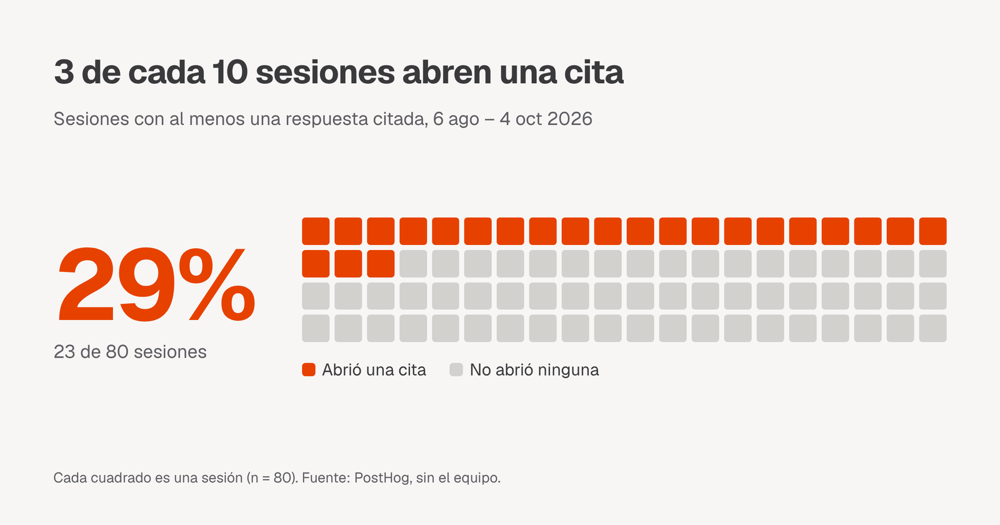

# La mejor forma de _verificar_ lo que nos dice nuestro agente

## Qué es Núcleo

Núcleo es el agente de inteligencia artificial de la Cámara Chilena de la Construcción (CChC). Está hecho para sus socios y colaboradores: le preguntas en lenguaje natural, en la web o por WhatsApp, y busca la respuesta en los documentos, estudios y datos del gremio. Informes de coyuntura, reglamentos, beneficios y cifras de la industria, en un solo lugar.

Pero una respuesta de IA solo sirve si puedes confiar en ella. Por eso Núcleo responde citando sus fuentes: marca la frase exacta que sale de cada documento y, con un clic, te lleva a la página donde está escrita, con el mismo pasaje resaltado.


Este post es sobre cómo está hecho: la parte que Bedrock nos regala y la parte que tuvimos que resolver nosotros, que es casi toda UX.

## Bedrock te da la cita casi gratis

Los documentos de la Cámara viven en SharePoint (y algunos en Notion). Un job los sincroniza a S3 y de ahí a una Knowledge Base de Amazon Bedrock, que los parsea con Bedrock Data Automation (BDA), los corta en chunks y los indexa.

Cuando el agente busca, llamamos a `Retrieve` (no a `RetrieveAndGenerate`: queremos que el agente decida entre buscar en documentos o consultar la base de datos, y controlar nosotros el formato de la cita). Cada resultado ya trae casi todo lo que una cita necesita:

- `content.text`: el pasaje exacto que se usó.
- `location.s3Location.uri`: de qué archivo salió.
- `metadata["x-amz-bedrock-kb-document-page-number"]`: la página, cuando el documento pasó por BDA.
- Para páginas escaneadas, un chunk `IMAGE` con la página como imagen y su transcripción en markdown. Se la adjuntamos al modelo para que lea cifras de gráficos y tablas.

Con eso armamos cada cita en el tool de búsqueda:

```ts
const rawPage = meta["x-amz-bedrock-kb-document-page-number"];
const page = typeof rawPage === "number" ? rawPage + 1 : null; // BDA cuenta desde 0

citations.push({
  n: refFor(source), // un número por documento, no por chunk
  title: titleFromSource(source),
  source,
  text, // el pasaje: después lo buscamos dentro del PDF
  page,
});
```

Dos detalles que aprendimos en el camino. Primero, la página viene desde 0 y todos los visores cuentan desde 1. Segundo, el mismo PDF puede estar en varias carpetas, y sus chunks vuelven con el mismo vector y exactamente el mismo score. Deduplicamos por `score + página` para que las copias no se coman los cupos de resultados.

Hasta acá, Bedrock hizo el trabajo pesado. Lo que nos entrega es una lista de pasajes con su archivo y su página. Convertir eso en algo que una persona realmente revise es otro problema.

## Lo difícil es la UX

### Un número por fuente

El prompt le pide al modelo citar con `[n]` justo después de la afirmación, donde `n` es el número de la fuente. Numeramos por documento, no por chunk: si tres pasajes salen del mismo informe, los tres son `[1]`. Para quien lee, "fuente 1" es un documento, no un trozo de texto.

### Del `[n]` a la frase resaltada

Un `[3]` al final de un párrafo no dice qué parte del párrafo respalda. Así que no mostramos el marcador: resaltamos la afirmación. Un plugin de remark recorre el markdown de la respuesta y, cuando encuentra un `[n]`, envuelve todo lo que hay desde el final de la frase anterior hasta el marcador. Si vienen seguidos (`[1][2]`), la misma frase queda con dos fuentes.

La parte delicada es saber dónde termina una frase:

```ts
// Puntuación seguida de espacio o fin de texto. El lookahead evita cortar
// en el separador de miles ("18.538") y en decimales.
const SENTENCE_END = /[.!?…:]["»)\]]?(?=\s|$)|\n/g;
```

En un agente que responde con cifras chilenas, "18.538 viviendas" aparece todo el tiempo. Sin ese lookahead, el resaltado partía en la mitad del número.

### Del resaltado a la página exacta

Al hacer clic se abre el documento. Para PDFs lo renderizamos con pdf.js, saltamos a la página que dio Bedrock y resaltamos el pasaje en el mismo naranja que en la respuesta, para que se lea como una sola cosa.

El problema: el texto del chunk no coincide carácter a carácter con el texto del PDF. BDA agrega markdown (`**`, `#`, tablas) y pdf.js entrega el texto partido en ítems con su propio espaciado. Buscar el pasaje completo no funciona. Lo que hacemos es normalizar los dos lados y marcar cada ítem de la página que aparezca dentro del chunk:

```ts
function normalize(text: string): string {
  return text
    .normalize("NFD")
    .replace(/[\u0300-\u036f]/g, "") // acentos: el PDF los combina distinto
    .replace(/[*#|_`]/g, "") // markdown de BDA
    .replace(/\s+/g, " ")
    .toLowerCase()
    .trim();
}
```

Los ítems de menos de 8 caracteres ("de", "2025", "%") se ignoran: aparecen en cualquier chunk y resaltarían media página suelta. Y cuando el documento no trae número de página, recorremos el PDF y abrimos la página con más texto coincidente.

No es perfecto. Es coincidencia por contención, no fuzzy: si el PDF corta una palabra a mitad de ítem, ese trozo no se resalta. En la práctica el pasaje se ve igual, y alinear el texto con Levenshtein queda para cuando se note.

Además de PDFs, los Word, Excel y PowerPoint se abren en vista previa, y cuando una cifra sale de una consulta SQL a la base de datos del Área de Estudios, esa consulta también queda citada.

## ¿Lo usan?

Desde que lanzamos los resaltados el 6 de agosto, PostHog registra cada clic en una cita. Sacando al equipo:



Y quienes abren citas vuelven más. De las personas que recibieron respuestas citadas, el 37,5 % de las que abrieron alguna volvió en una semana posterior, contra el 18,8 % de las que nunca abrieron una:


Son muestras chicas y es correlación, no causa: quien ya usa mucho Núcleo probablemente también verifica más. Pero va en la dirección que esperábamos.

## We think this is the bare minimum

Una respuesta de IA vale lo que vale su fuente. Con el pasaje resaltado en ambos lados, revisar una cifra toma segundos. Esto resulta en confianza y seguridad para nuestros usuarios. Cada afirmación es fácil y rápidamente factcheckeable.

En bipbop creemos que la visibilidad y transparencia de lo que "está pasando detrás" es clave para ofrecer una UX satisfactoria, El hecho de que toda esta trazabilidad esté a un click de distancia nos acerca hacia una retención y engagement saludable con las plataformas que desarrollamos.

No solo socios y colaboradores de la CChC pueden acceder a Núcleo, sino que el público general puede probarlo para comprender mejor la información pública que la Cámara dispone a la ciudadanía en general, puedes probarlo en [nucleo.cchc.cl](https://nucleo.cchc.cl). Si una cita no te lleva al lugar correcto, se marca con el pulgar abajo y la revisamos.
